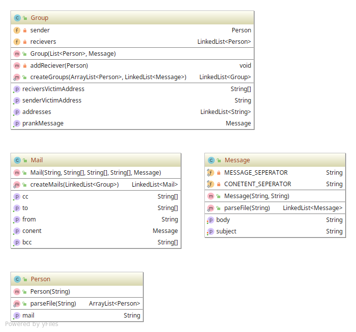
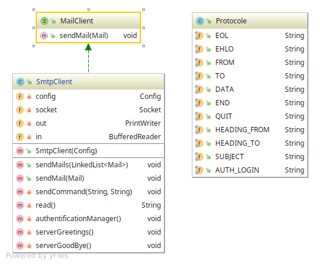
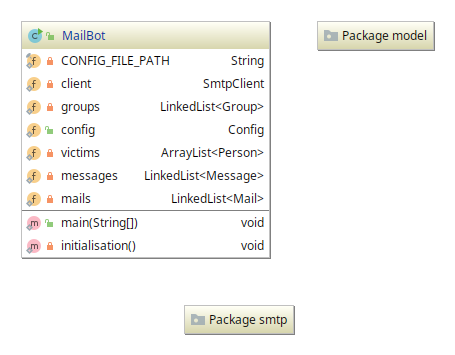

# Teaching-HEIGVD-RES-2019-Labo-SMTP

Legrand Bruno, Page Didier

15 avril 2019

#### <u>Description</u>

The aim of this project is to develop a client application (TCP) in Java. This client application use the socket API to communicate with an SMTP server and plays pranks on a list of victims.


#### <u>Setting up mock SMTP server with Docker</u>

To set up the mock SMTP server we use a docker container accessible by ports mapping. In this project we use for the container ports 8080 (web interface) and 2525 (SMTP protocol) 

To build the corresponding docker image use the command in the directory named *Docker* :

```bash
docker build -t "res-smtp" .
```

Then run an instance of this fresh docker image with the correct port mapping.

```bash
docker run --rm --name smtpServer -d -p 8080:8080 -p 2525:2525 res-smtp

```

#### <u>Instruction for a prank campaign</u>

To run a prank campaign you have to modify 3 files : 

1. **prankMessage.txt**, in this file you will add your email subject and content and the separator "===" like this:

   ```bash
   subject: <your subject>
   content: <your content>
   ===
   ```

2. **emails.txt**, in this file you will add email addresses of victims, one per line like this :

   ```bash
   email_1@example.com
   email_2@example.com
   ```

   

3. **config.properties**, in this file you can parametrize SMTP server address, SMTP server Port, number of groups you want to create. In one group, one sender victims is chosen and the other are receiver victim. Default values are :

   ```properties
   serverAddress=localhost
   serverPort=2525
   nbGroup=2
   authlogin=false
   ```


If you want to use **authentication**, you need add *username* and *passwd* to the configuration file. 

```properties
    serverAddress=smtp.mailtrap.io
    serverPort=2525
    nbGroup=2
    authlogin=true
    username=a023b304611e91
    password=7dc21f84a07ee5
```

Please take note that the username and the passowd are encoded into *Base64* before being sent.

#### <u>Description of the implementation</u>

We split the code into 3 sub-packages :


1. model, which contains all informations about the victims and emails

   

2. smtp, which contains relevant code to the protocol SMTP and the TCP client

   

3. All of these package are contained in the package ch.heigvd.res and we found our program main class

    


